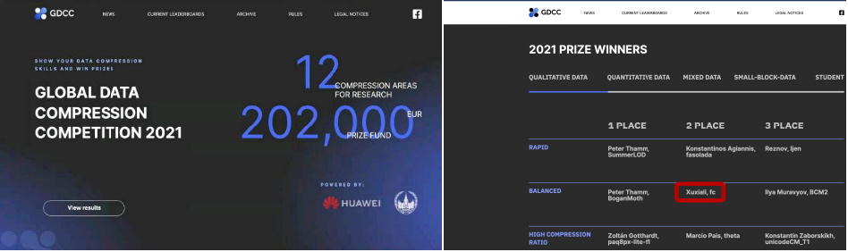

# PBGZ 

- 可以理解为： **P**hytium & **B**IG 的研究人员一起发起的一个极具竞争力的高速.高压缩比大型 **G**enomic数据或大型通用数据的压缩(**Z**ip)工具。
- 也可以理解为：支持PB级别的 **G**enomic数据或大型通用数据的压缩(**Z**ip)工具。

# PBGZ 的优势

- 极致压缩率：最高可达 gzip 的8倍。
- 极致加解压速度：最高可达 gzip 的13倍。
- 先进算法：采用 Phytium ResearchLab 在2021 全球压缩竞赛中 平衡组第2名的 FC 高效压缩算法
- 多平台支持：在Intel/AMD等x86_64 和 飞腾等ARMv8体系结构 CPU 上均可高效运行；支持 麒麟.Ubuntu等Linux 和 MAC OSX 操作系统。
- 多种数据支持：针对基因数据专门优化，但同时支持任意二进制文件的压缩；
- 完全自由开放：基于 MIT License 开源，允许任何人.任何组织使用.修改和分发。

| 指标/特性              | 平台    | GZip (.gz)    | Enancio (.ora)                               | Ours                             |
|----------------------|---------|---------------|-----------------------------------------------|---------------------------------|
| **压缩率**            | NovaSeq | 17.01%        | 2.7%                                          | 2.4%                            |
|                      | T7      | 35.51%        | ---                                           | 17.03%                          |
| **压缩速度**           | NovaSeq| 19.54MB/s     | 240MB/s (白皮书)                               | **265.84MB/s**                   |
|                       | T7     | 12.87MB/s     | ---                                           | **144MB/s**                     |
| **发布包不需要字典数据** |        | Yes           | No, 发布包必须配600MB的字典                      | Yes (直接使用用户的fasta)           |
| **支持多物种参考基因组** |        | ---           | No, 目前受发布包600MB字典数据影响，实际很难支持多种物种基因数据。 | Yes, 可以广泛支持所有物种  |
| **支持的体系结构**      |        | x86_64，ARMv8  | x86_64                                        | x86_64，ARMv8                    |
| **解压不需要参考基因组** |        | Yes           | No，必须依赖发布包的bin数据                       | Yes                              |
| **支持MD5校验**        |        | No            | Yes                                           | Yes                              |
| **支持多个压缩包直接合并**|       | Yes             | No                                           | Yes                             |

